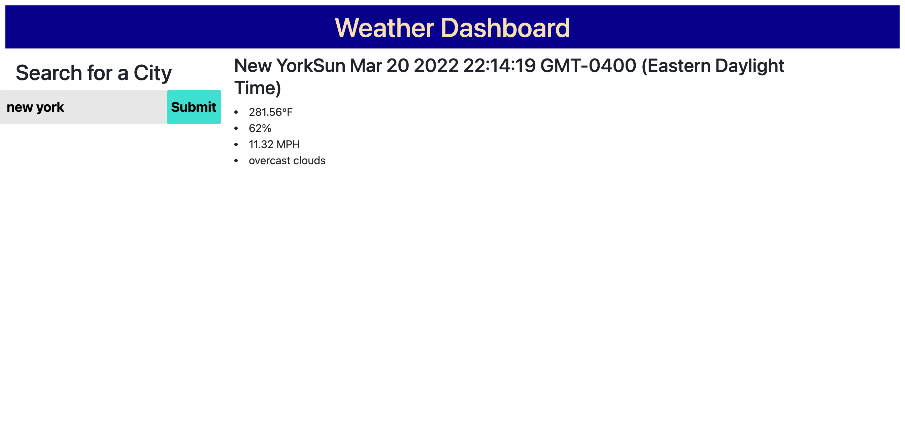

# Weather Dashboard

## Purpose
We are designing a weather dashboard to help travelers who want to see the weather outlook for multiple cities so that can plan a trip accordingly

## Steps to Take
- Add the search button
- Add the date for the current weather
- Add city name, humidity, temperature, etc to the dashboard
- TODO: Add an icon  that represent the weather condition
- Add a color that indicates whether the conditions are favorable, moderate, or severe
- Add future weather condition for that city
- Add 5-day forecast with dates, icons, temperatures, wind speeds and humidities
- Display search history
- Add the function to navigate to the info related to the city in search history

## Screenshot

## Link to the Application
[Weather Dashboard](https://wangheer2010.github.io/WeatherDashboard/)